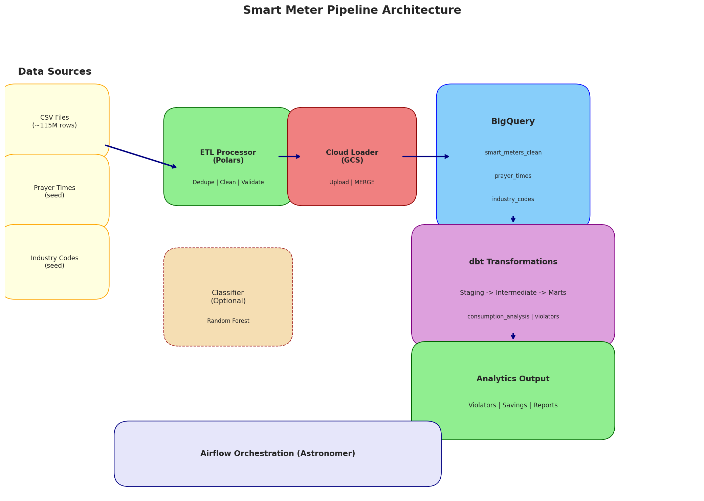

# Stage 1: Planning

## Purpose
Define the problem, use case, and success criteria before any data work begins.

---

## Key Activities

### 1.1 Problem Statement

**Business Problem**: Mosques in Saudi Arabia are consuming excessive electricity during prayer periods when they should be minimally occupied. This represents both financial waste and environmental impact.

**Scope**: Analysis of smart meter data from ~28,000 mosque facilities across Saudi Arabia to identify over-consuming facilities ("violators") and calculate potential savings.

**Constraints**:
- Data quality varies significantly across meters
- Prayer times vary by geographic location
- Some meters have multiplication factors that need to be applied
- Ramadan period has different consumption patterns

### 1.2 Use Case Definition

| Attribute | Value |
|-----------|-------|
| **Primary Use Case** | Identify meters consuming >3000W during prayer periods |
| **Secondary Use Case** | Calculate potential cost savings if violators reduce consumption |
| **Target Users** | Energy management teams, facility managers |
| **Decision Support** | Prioritize which facilities to audit/intervene |

**User Stories**:
1. As an energy manager, I want to identify which mosques consume excessive power during prayer times so I can prioritize facility audits.
2. As a financial analyst, I want to calculate potential savings from reducing over-consumption to justify intervention programs.
3. As a regional manager, I want to compare consumption patterns across provinces to allocate resources effectively.

### 1.3 Success Criteria

| Metric | Target | Measurement |
|--------|--------|-------------|
| Violator Detection Rate | Identify >90% of actual over-consumers | Cross-validation with manual audits |
| Data Quality Coverage | >50% quality score for included meters | Quality percentage metric |
| Processing Time | <30 minutes for full pipeline | Airflow task duration |
| Cost Calculation Accuracy | Within 5% of actual billing | Comparison with utility bills |

**Mosque Classifier Success Criteria** (Illustrative ML Component):
| Metric | Target |
|--------|--------|
| Accuracy | >90% |
| Precision (Mosque class) | >90% |
| Recall (Mosque class) | >90% |
| F1 Score | >90% |

### 1.4 Data Availability Assessment

| Data Source | Records | Availability | Quality |
|-------------|---------|--------------|---------|
| Smart Meter Readings | ~115M raw readings | Available | 60% duplicates |
| Prayer Times | 365 days x ~100 locations | Available | High |
| Industry Codes (Meter Metadata) | ~28,000 meters | Available | Some missing factors |

**Data Access**:
- [x] Smart meter data accessible via CSV files
- [x] Prayer times available for all required coordinates
- [x] Meter metadata (industry codes) with locations and multiplication factors

### 1.5 Stakeholder Approval

**Key Stakeholders**:
| Role | Responsibility | Approval Required |
|------|----------------|-------------------|
| Energy Management Team | Primary users of analysis | Use case validation |
| IT/Data Engineering | Infrastructure & pipeline | Technical approach |
| Finance | Cost calculations | Business metrics |

---

## ML Component: Mosque Classifier (Illustrative)

For demonstrating the ML lifecycle, we include a binary classifier to identify whether a meter's consumption pattern indicates a mosque vs. non-mosque facility.

**Problem Formulation**:
- **Type**: Binary Classification
- **Target**: `is_mosque` (1 = Mosque, 0 = Non-Mosque)
- **Features**: Consumption patterns during prayer periods, Friday ratios, daily variance

**Hypothesis**: Mosques have distinctive consumption patterns:
1. Higher consumption during prayer times (Fajr, Dhuhr, Asr, Maghrib, Isha)
2. Significantly elevated Friday consumption (Jummah prayer)
3. Predictable daily spikes at prayer times
4. No typical weekend drop-off (unlike offices)

---

## Deliverables

- [x] Problem statement documented
- [x] Use case defined with user stories
- [x] Success criteria established with measurable targets
- [x] Data availability confirmed
- [x] ML problem formulated (illustrative classifier)

---

## Who's Involved

| Role | Involvement |
|------|-------------|
| Data Scientist | Problem formulation, success criteria |
| Data Engineer | Data availability assessment |
| Business Stakeholder | Use case validation, approval |
| Domain Expert | Prayer time logic, threshold definition |

---

## Gate: Business Approval

**Decision**: Proceed to Data Preparation

**Rationale**:
1. Clear business problem with measurable impact
2. Data sources identified and accessible
3. Success criteria defined and achievable
4. Stakeholder alignment on approach

**Sign-off Date**: Project initiation

---

## Pipeline Architecture



---

## Appendix: Project Configuration

### Threshold Configuration (`dbt_project.yml`)
```yaml
vars:
  # Electricity rate in Saudi Riyals per kWh
  electricity_rate_sar: 0.32
  # Threshold for flagging over-consumption during prayer periods (watts)
  violation_threshold_watts: 3000
  # Expected baseline consumption for savings calculation (watts)
  baseline_consumption_watts: 500
  # Minimum data quality percentage to include meter in analysis
  quality_threshold_pct: 50
```

### Key Business Rules
1. **Violation Threshold**: 3000W average consumption during prayer periods
2. **Quality Threshold**: Meters must have >50% quality score to be included
3. **Electricity Rate**: 0.32 SAR per kWh for cost calculations
4. **Baseline Consumption**: 500W assumed normal level for savings calculation
