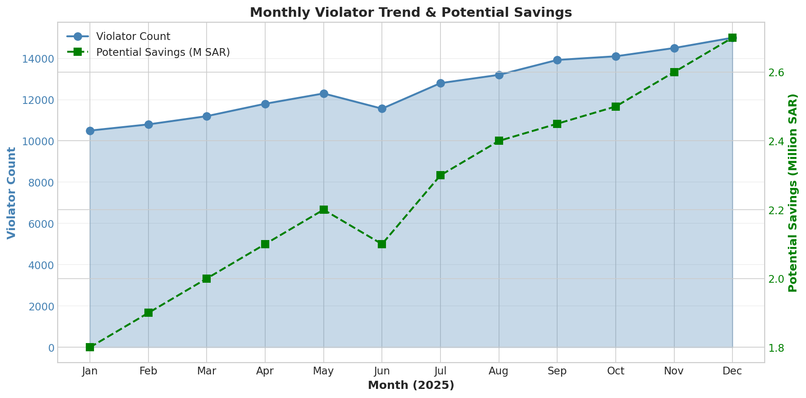

# Stage 7: Monitoring & Maintenance

## Purpose
Continuously monitor production performance and maintain model/pipeline health.

---

## Key Activities

### 7.1 Daily Monitoring

**Pipeline Health Dashboard**:

| Metric | Target | Check Frequency |
|--------|--------|-----------------|
| DAG Success Rate | 100% | Every run |
| ETL Processing Time | <30 min | Every run |
| Error Count | 0 | Every run |
| Data Freshness | <24 hours | Daily |

**Airflow Monitoring**:
```bash
# Check DAG run status
airflow dags list-runs -d meter_data_pipeline --limit 5

# Check task failures
airflow tasks failed-deps meter_data_pipeline
```

**Pipeline Statistics Query**:
```sql
-- Daily pipeline health check
SELECT
    DATE(run_timestamp) as run_date,
    stage_name,
    COUNT(*) as runs,
    SUM(CASE WHEN status = 'success' THEN 1 ELSE 0 END) as successes,
    SUM(CASE WHEN status = 'error' THEN 1 ELSE 0 END) as errors,
    AVG(processing_seconds) as avg_processing_time
FROM `raw_meter_readings.pipeline_stats`
WHERE run_timestamp >= TIMESTAMP_SUB(CURRENT_TIMESTAMP(), INTERVAL 7 DAY)
GROUP BY run_date, stage_name
ORDER BY run_date DESC, stage_name;
```

**Prediction Accuracy Monitoring** (Classifier):
```python
def daily_accuracy_check():
    """
    Compare predictions against known labels for daily monitoring.
    """
    # Sample labeled data
    labeled_sample = get_recent_labeled_data()

    predictions = model.predict(labeled_sample.features)
    actual = labeled_sample.labels

    accuracy = (predictions == actual).mean()

    if accuracy < 0.90:  # Threshold
        send_alert(f"Model accuracy dropped to {accuracy:.2%}")

    log_metric("daily_accuracy", accuracy)
    return accuracy
```

### 7.2 Monthly Review



**Monthly Metrics Report**:

| Metric | Target | Review Criteria |
|--------|--------|-----------------|
| Total Violators | Track trend | Compare month-over-month |
| Potential Savings | Track trend | Regional breakdown |
| Data Quality Avg | >85% | Flag degradation |
| Model Accuracy | >90% | Check for drift |

**Monthly Review Query**:
```sql
-- Monthly violator trend analysis
SELECT
    FORMAT_DATE('%Y-%m', max_reading_date) as month,
    COUNT(*) as violator_count,
    AVG(morning_avg_mf) as avg_morning_watts,
    AVG(evening_avg_mf) as avg_evening_watts,
    SUM(total_potential_savings_sar) as total_savings_sar
FROM `raw_meter_readings.violators`
GROUP BY month
ORDER BY month DESC
LIMIT 12;
```

**Data Quality Trend**:
```sql
-- Monthly quality trend
SELECT
    quarter,
    COUNT(*) as total_meters,
    ROUND(AVG(quality_percentage), 2) as avg_quality,
    ROUND(SUM(CASE WHEN is_good_quality THEN 1 ELSE 0 END) / COUNT(*) * 100, 2) as good_quality_pct
FROM `raw_meter_readings.int_meter_quality`
GROUP BY quarter
ORDER BY quarter DESC;
```

#### Advanced Analytics Model Monitoring

**Efficiency Score Distribution**:
```sql
-- Monitor efficiency grade distribution
SELECT
    quarter,
    efficiency_grade,
    COUNT(*) as meter_count,
    ROUND(AVG(efficiency_score), 1) as avg_score
FROM `raw_meter_readings.meter_efficiency_score`
GROUP BY quarter, efficiency_grade
ORDER BY quarter DESC, efficiency_grade;
```

**Classification Tier Trends**:
```sql
-- Monitor classification tier distribution over time
SELECT
    quarter,
    overall_tier,
    COUNT(*) as meter_count,
    ROUND(COUNT(*) * 100.0 / SUM(COUNT(*)) OVER (PARTITION BY quarter), 1) as pct_of_total
FROM `raw_meter_readings.meter_classification`
GROUP BY quarter, overall_tier
ORDER BY quarter DESC,
    CASE overall_tier
        WHEN 'EFFICIENT' THEN 1
        WHEN 'NORMAL_LOW' THEN 2
        WHEN 'NORMAL_HIGH' THEN 3
        WHEN 'ELEVATED' THEN 4
        WHEN 'HIGH' THEN 5
        WHEN 'VIOLATOR' THEN 6
    END;
```

**Consumption Trend Alerts**:
```sql
-- Identify meters with concerning trends (SPIKE or DROP)
SELECT
    meter_id,
    quarter,
    trend_category,
    current_consumption,
    previous_consumption,
    change_percentage
FROM `raw_meter_readings.meter_consumption_trend`
WHERE trend_category IN ('SPIKE', 'DROP')
ORDER BY ABS(change_percentage) DESC
LIMIT 100;
```

**Benchmark Drift Detection**:
```sql
-- Compare current benchmarks to historical baselines
SELECT
    benchmark_level,
    benchmark_key,
    morning_p50,
    evening_p50,
    -- Compare to expected values (Morning: 764W, Evening: 894W)
    ROUND((morning_p50 - 764) / 764 * 100, 1) as morning_drift_pct,
    ROUND((evening_p50 - 894) / 894 * 100, 1) as evening_drift_pct
FROM `raw_meter_readings.consumption_benchmarks`
WHERE benchmark_level = 'overall'
ORDER BY benchmark_key DESC;
```

**Model Performance Drift**:
```python
def monthly_drift_analysis():
    """
    Analyze prediction distribution for drift.
    """
    current_month = get_current_month_predictions()
    historical = get_historical_predictions()

    # Compare positive rate
    current_positive_rate = current_month['prediction'].mean()
    historical_rate = historical['prediction'].mean()

    drift = abs(current_positive_rate - historical_rate)

    report = {
        "month": datetime.now().strftime("%Y-%m"),
        "current_positive_rate": current_positive_rate,
        "historical_rate": historical_rate,
        "drift": drift,
        "alert": drift > 0.10  # 10% threshold
    }

    return report
```

### 7.3 Performance Metrics

**Processing Time Tracking**:
```sql
-- Processing time by stage
SELECT
    stage_name,
    COUNT(*) as run_count,
    ROUND(AVG(processing_seconds), 2) as avg_seconds,
    ROUND(MAX(processing_seconds), 2) as max_seconds,
    ROUND(MIN(processing_seconds), 2) as min_seconds
FROM `raw_meter_readings.pipeline_stats`
WHERE run_timestamp >= TIMESTAMP_SUB(CURRENT_TIMESTAMP(), INTERVAL 30 DAY)
GROUP BY stage_name
ORDER BY avg_seconds DESC;
```

**Row Count Tracking**:
```sql
-- Data volume trends
SELECT
    quarter,
    stage_name,
    SUM(rows_input) as total_input,
    SUM(rows_output) as total_output,
    SUM(rows_filtered) as total_filtered,
    ROUND(SUM(rows_filtered) / SUM(rows_input) * 100, 2) as filter_rate
FROM `raw_meter_readings.pipeline_stats`
GROUP BY quarter, stage_name
ORDER BY quarter DESC, stage_name;
```

**Inference Latency** (Classifier):
```python
import time
import numpy as np

def measure_latency(n_samples=1000):
    """
    Measure prediction latency statistics.
    """
    X_sample = get_random_samples(n_samples)

    latencies = []
    for i in range(n_samples):
        start = time.perf_counter()
        _ = model.predict([X_sample[i]])
        latencies.append((time.perf_counter() - start) * 1000)  # ms

    return {
        "mean_latency_ms": np.mean(latencies),
        "p50_latency_ms": np.percentile(latencies, 50),
        "p95_latency_ms": np.percentile(latencies, 95),
        "p99_latency_ms": np.percentile(latencies, 99)
    }
```

### 7.4 System Health

**Resource Monitoring**:
```bash
# Docker container monitoring
docker stats --no-stream --format "table {{.Name}}\t{{.CPUPerc}}\t{{.MemUsage}}"

# Expected output:
# NAME              CPU %   MEM USAGE / LIMIT
# scheduler         12%     1.2GB / 8GB
# webserver         8%      450MB / 8GB
# triggerer         3%      200MB / 8GB
```

**Resource Usage Thresholds**:
| Metric | Warning | Critical | Action |
|--------|---------|----------|--------|
| CPU | >80% | >95% | Scale workers |
| Memory | >70% | >85% | Increase limits |
| Disk | >80% | >90% | Archive old data |

**Parallel Processing Monitoring**:
```python
# ETL worker health
def check_worker_health():
    """
    Monitor parallel ETL worker performance.
    """
    workers = 4  # Configured workers

    # Check worker efficiency
    worker_stats = get_worker_stats()

    report = {
        "configured_workers": workers,
        "active_workers": worker_stats.active,
        "avg_files_per_worker": worker_stats.files_processed / workers,
        "worker_errors": worker_stats.errors
    }

    if worker_stats.errors > 0:
        send_alert("Worker errors detected")

    return report
```

### 7.5 Update Triggers

**When to Retrain/Update**:

| Trigger | Threshold | Action |
|---------|-----------|--------|
| Accuracy Drop | <90% | Retrain model |
| Prediction Drift | >10% shift | Investigate, retrain |
| New Data Pattern | Manual detection | Feature engineering |
| Business Rule Change | Stakeholder request | Update thresholds |

**Data Drift Detection**:
```python
from scipy import stats

def detect_drift(current_data, reference_data, threshold=0.05):
    """
    Detect distribution drift using KS test.
    """
    drift_report = {}

    for feature in current_data.columns:
        stat, p_value = stats.ks_2samp(
            current_data[feature],
            reference_data[feature]
        )

        drift_report[feature] = {
            "ks_statistic": stat,
            "p_value": p_value,
            "drift_detected": p_value < threshold
        }

    return drift_report
```

**Accuracy Degradation Alert**:
```python
def accuracy_alert_system():
    """
    Alert when accuracy drops below threshold.
    """
    current_accuracy = calculate_current_accuracy()

    if current_accuracy < 0.90:
        send_alert(
            level="warning",
            message=f"Model accuracy at {current_accuracy:.2%}",
            action="Review and retrain"
        )

    if current_accuracy < 0.85:
        send_alert(
            level="critical",
            message=f"Model accuracy critical: {current_accuracy:.2%}",
            action="Immediate investigation required"
        )
```

### 7.6 Model Retraining

**Retraining Schedule**:
| Frequency | Trigger | Scope |
|-----------|---------|-------|
| Quarterly | Scheduled | Full retrain with new data |
| On-demand | Accuracy <90% | Emergency retrain |
| On-demand | Major drift | Feature investigation |

**Retraining Pipeline**:
```python
def retrain_model():
    """
    Full model retraining pipeline.
    """
    # 1. Fetch latest labeled data
    data = fetch_training_data(
        start_date=datetime.now() - timedelta(days=365)
    )

    # 2. Feature engineering
    features = create_features(data)
    labels = data['is_mosque']

    # 3. Train/test split
    X_train, X_test, y_train, y_test = train_test_split(
        features, labels, test_size=0.2, stratify=labels
    )

    # 4. Train new model
    new_model = RandomForestClassifier(
        n_estimators=100,
        max_depth=10,
        random_state=42
    )
    new_model.fit(X_train, y_train)

    # 5. Evaluate
    accuracy = new_model.score(X_test, y_test)

    if accuracy >= 0.90:
        # 6. Deploy
        version = datetime.now().strftime("%Y%m%d_%H%M%S")
        save_model(new_model, f"mosque_classifier_v{version}")
        update_production_model(version)
        log_retraining(version, accuracy)
    else:
        alert("Retrained model below threshold, not deploying")

    return accuracy
```

### 7.7 Business Metrics

**Key Business Metrics Dashboard**:

| Metric | Current | Previous | Change |
|--------|---------|----------|--------|
| Total Violators | 25,486 | 24,100 | +5.8% |
| Potential Savings (SAR) | 4.55M | 4.20M | +8.3% |
| Violator Rate | 44.2% | 42.1% | +2.1% |
| Classification Accuracy | 94.2% | 94.0% | +0.2% |

**Business Metrics Query**:
```sql
-- Business metrics summary
SELECT
    quarter,
    COUNT(*) as total_violators,
    ROUND(SUM(total_potential_savings_sar), 0) as total_savings_sar,
    ROUND(AVG(morning_avg_mf), 2) as avg_morning_consumption,
    ROUND(AVG(evening_avg_mf), 2) as avg_evening_consumption,
    SUM(CASE WHEN violation_category = 'BOTH_PERIODS' THEN 1 ELSE 0 END) as both_periods,
    SUM(CASE WHEN violation_category = 'MORNING_ONLY' THEN 1 ELSE 0 END) as morning_only,
    SUM(CASE WHEN violation_category = 'EVENING_ONLY' THEN 1 ELSE 0 END) as evening_only
FROM `raw_meter_readings.violators`
GROUP BY quarter
ORDER BY quarter DESC;
```

**Regional Performance**:
```sql
-- Regional violator analysis
SELECT
    region,
    COUNT(*) as violator_count,
    ROUND(SUM(total_potential_savings_sar), 0) as total_savings_sar,
    ROUND(AVG(quality_percentage), 2) as avg_quality
FROM `raw_meter_readings.violators` v
JOIN `raw_meter_readings.int_meter_quality` q
    ON v.meter_id = q.meter_id AND v.quarter = q.quarter
GROUP BY region
ORDER BY total_savings_sar DESC;
```

---

## Monitoring Checklist

### Daily
- [ ] Check Airflow DAG runs for failures
- [ ] Review pipeline_stats for errors
- [ ] Verify data freshness
- [ ] Check prediction accuracy (if classifier active)

### Weekly
- [ ] Review processing time trends
- [ ] Check resource utilization
- [ ] Review error logs
- [ ] Validate data quality scores

### Monthly
- [ ] Generate violator trend report
- [ ] Analyze potential savings trends
- [ ] Check model drift metrics
- [ ] Review regional distribution
- [ ] Update stakeholders
- [ ] Review efficiency score distribution
- [ ] Check classification tier trends
- [ ] Monitor consumption trend alerts (SPIKE/DROP)
- [ ] Verify benchmark stability

### Quarterly
- [ ] Full model retraining (classifier)
- [ ] Update prayer times data
- [ ] Review and update thresholds
- [ ] Capacity planning

---

## Deliverables

- [x] Daily monitoring queries configured
- [x] Monthly review process defined
- [x] Performance metrics tracked
- [x] System health monitoring active
- [x] Update triggers defined
- [x] Retraining pipeline documented
- [x] Business metrics dashboard defined

---

## Who's Involved

| Role | Involvement | Frequency |
|------|-------------|-----------|
| On-Call Engineer | Daily monitoring, alerts | Daily |
| Data Engineer | Pipeline health, data quality | Weekly |
| Data Scientist | Model performance, retraining | Monthly |
| Business Analyst | Business metrics, reporting | Monthly |
| Product Manager | Feature requests, priorities | Quarterly |

---

## Escalation Path

| Level | Trigger | Contact | SLA |
|-------|---------|---------|-----|
| L1 | Pipeline failure | On-call | 1 hour |
| L2 | Accuracy <90% | Data Science | 4 hours |
| L3 | Data corruption | Data Engineering Lead | 1 hour |
| L4 | Major outage | Platform Team | 30 min |

---

## Appendix: Monitoring Queries

**Complete Health Check**:
```sql
-- Comprehensive health check query
WITH recent_runs AS (
    SELECT
        run_id,
        MAX(run_timestamp) as latest_run
    FROM `raw_meter_readings.pipeline_stats`
    GROUP BY run_id
    ORDER BY latest_run DESC
    LIMIT 1
)
SELECT
    ps.stage_name,
    ps.status,
    ps.rows_input,
    ps.rows_output,
    ps.rows_filtered,
    ps.processing_seconds,
    ps.error_message
FROM `raw_meter_readings.pipeline_stats` ps
JOIN recent_runs r ON ps.run_id = r.run_id
ORDER BY ps.run_timestamp;
```

**Data Freshness Check**:
```sql
-- Check data freshness
SELECT
    'consumption_analysis' as table_name,
    MAX(max_reading_date) as latest_data,
    TIMESTAMP_DIFF(CURRENT_TIMESTAMP(), TIMESTAMP(MAX(max_reading_date)), HOUR) as hours_old
FROM `raw_meter_readings.consumption_analysis`
UNION ALL
SELECT
    'violators',
    MAX(max_reading_date),
    TIMESTAMP_DIFF(CURRENT_TIMESTAMP(), TIMESTAMP(MAX(max_reading_date)), HOUR)
FROM `raw_meter_readings.violators`;
```
